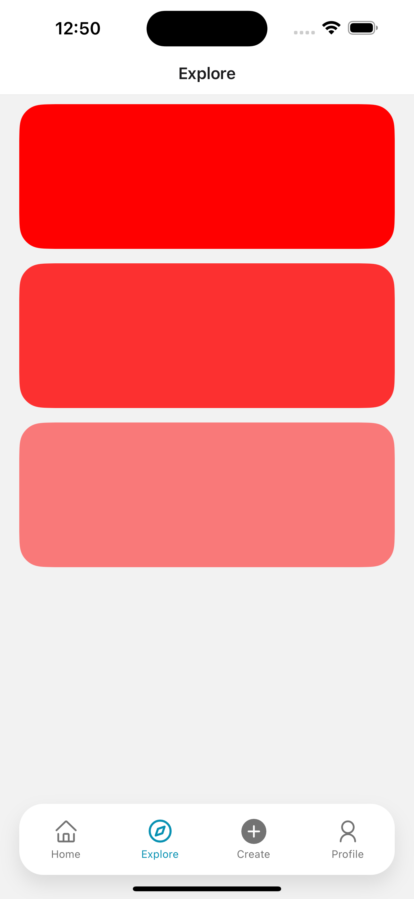

# React Native Expo Tab Navigation

This project demonstrates an implementation of the Expo Tab, with React native bottom tabs, for full customization



## Tech Stack

- [Expo](https://expo.dev) - React Native development platform
- [Expo Tab](https://docs.expo.dev/router/advanced/tabs/)
- [React Navigation](https://reactnavigation.org/docs/bottom-tab-navigator/) - (Bottom Tab Navigator)

## Getting Started

1. Install dependencies:

   ```bash
   npm install
   ```

2. Start the development server:

   ```bash
   npx expo start
   ```

3. Open in iOS Simulator or Android Emulator:
   - Press `i` for iOS
   - Press `a` for Android
